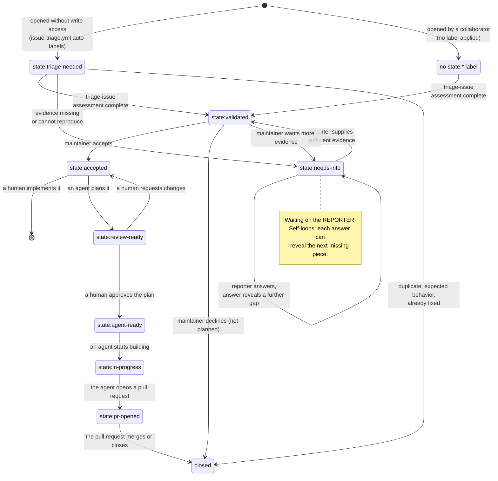
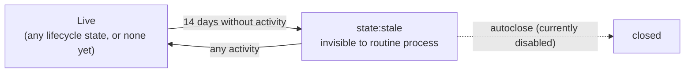

OpenShell separates technical assessment, roadmap decisions, sequencing, and agent delegation. Each is a distinct decision recorded by a distinct signal, and conflating them is the most common source of confusion about whether an issue is ready to work on.

An open issue is not automatically accepted or ready for implementation. Check its `state:*` label before starting work, and ask a maintainer when its status is unclear.

The canonical machine-readable definition of every lifecycle label lives in [`.agents/issue-lifecycle.yaml`](https://github.com/NVIDIA/OpenShell/blob/main/.agents/issue-lifecycle.yaml). That file is the source of truth. No document, skill, or workflow may reference a `state:*` label it does not declare, and every label it declares exists on GitHub.

## The Four Decisions

Each issue can require four independent decisions.

| Decision | Question | Recorded by |
|---|---|---|
| Assessment | Is the report technically valid, and is there enough evidence to act on it? | `state:*` |
| Disposition | Should OpenShell pursue the work? | `state:accepted`, roadmap placement, or closure as not planned |
| Sequencing | Where does accepted work sit relative to everything else? | Placement on the [OpenShell Roadmap](https://github.com/orgs/NVIDIA/projects/233) |
| Ownership | Will a human implement the issue, will a user directly instruct an agent, or will a maintainer delegate it to an unattended agent? | Direct instruction or the delegated `state:*` workflow |

`state:validated` confirms that the factual assessment is complete, but it does not mean the project has accepted the work. A maintainer signals acceptance with `state:accepted` or roadmap placement. Roadmap placement also communicates sequencing, but it does not assign an owner or delegate to an unattended agent.

## Who Controls Each Decision

Agents investigate issues, collect evidence, and report technical findings. Humans retain the product and investment decisions.

| Action | Who performs it |
|---|---|
| Assess technical validity and impact | Triage agent or human triager |
| Request missing evidence | Triage agent or human triager |
| Mark the assessment complete with `state:validated` | Triage agent or human triager |
| Accept or decline the work with `state:accepted`, roadmap placement, or closure | Maintainer |
| Place the issue on the roadmap or move it | Maintainer |
| Directly request an agent plan | User |
| Accept the issue so an unattended agent may plan it | Maintainer |
| Produce a plan, implement it, and open a pull request | Agent |
| Directly request agent implementation | User |
| Approve implementation with `state:agent-ready` | Maintainer |

Agents do not apply `state:accepted`, place issues on the roadmap, or apply `state:agent-ready`. A direct request may authorize work outside the recorded workflow, but it does not alter the issue's disposition or make the labels accurate.

## Issue State

The `state:*` namespace records the issue's disposition for all contributors, regardless of who might implement it.

| State | Meaning | Normal next action |
|---|---|---|
| `state:triage-needed` | The issue has not been assessed. New issues from users without repository write access receive this automatically. | Investigate the report and record the result. |
| `state:needs-info` | The assessment needs specific evidence or reproduction details. | The reporter or another contributor supplies the requested information. |
| `state:validated` | The factual assessment is complete. | A maintainer accepts the issue, declines it, or asks for more evidence. |
| `state:accepted` | A maintainer decided that OpenShell should pursue the issue. | A human implements it, or a maintainer delegates it to an agent. |
| `state:review-ready` | An agent produced an implementation plan and is waiting on a human to read it. | A human reviews the plan and either requests changes or authorizes the build. |
| `state:agent-ready` | A human reviewed the plan and authorized an agent to build it. | An agent implements the approved plan. |
| `state:in-progress` | An agent is implementing the approved plan. | The agent opens a pull request, or reports that it could not finish. |
| `state:pr-opened` | Implementation produced a pull request. | The pull request is reviewed and merged or closed. |

Keep exactly one of these states on an open issue. When new evidence resolves a `state:needs-info` request, reassess the issue and move it to `state:validated` if the evidence is sufficient.

The assessment phase is where most issues spend their time, and `state:needs-info` can repeat. Each answer from a reporter can reveal the next missing piece.



## Staleness Is a Boundary, Not a State

`state:stale` does not appear in the table above because it is not a lifecycle state. It is an orthogonal inactivity marker. An item that goes stale keeps whatever lifecycle state it already had, drops out of every routine process except automatic closure, and rejoins on activity.



This distinction matters when you write tooling. A stale item is out of consideration entirely. It is not a triage candidate and not a delegation candidate, and it re-enters through activity rather than through a scan.

Inactive issues and pull requests are labeled `state:stale` after 14 days without activity. Automated closing is currently disabled. Comment on the item or remove `state:stale` to keep it active. Issues awaiting triage or human disposition, accepted issues, issues in any in-flight delegated state, and roadmap issues are exempt. An issue in `state:needs-info` can go stale when no new evidence arrives.

## Assessing an Incoming Issue

Triage checks the user story, reproduction or workflow, environment, related issues, current releases, and the relevant code paths. The assessment ends in one of these outcomes.

| Outcome | State or resolution |
|---|---|
| A bug is confirmed. | Replace the intake state with `state:validated`. |
| A feature proposal is technically coherent and feasible. | Replace the intake state with `state:validated`. |
| The report is credible but needs a deeper investigation or spike. | Add the `spike` label when available and use `state:validated` so a human can decide whether to invest in the investigation. |
| Critical evidence is missing, or a faithful attempt cannot reproduce the problem. | Use `state:needs-info` and request the exact evidence needed. |
| A released change already fixes the behavior. | Explain the fix and version. Close the issue only when the causal link is clear; otherwise request a retest. |
| Another issue is the canonical report. | Link the canonical issue and close the duplicate. |
| The behavior is expected or caused by unsupported configuration. | Explain the finding and close the issue with the appropriate GitHub reason. |
| The report describes a security vulnerability. | Stop public triage and follow the private process in [`SECURITY.md`](https://github.com/NVIDIA/OpenShell/blob/main/SECURITY.md). |

Triage establishes facts and impact. It does not decide whether the project should spend time on the work.

## Human Disposition

When an issue reaches `state:validated`, a maintainer chooses one of three paths.

- **Accept:** apply `state:accepted`, place the issue on the roadmap, or do both. Either action signals that OpenShell should pursue the work; roadmap placement additionally records sequencing.
- **Decline:** close it as not planned and record the rationale.
- **Await more evidence:** replace `state:validated` with `state:needs-info` and leave it off the roadmap.

Do not use `state:accepted` as shorthand for technical validity, roadmap sequencing, or agent authorization. It records the human decision that OpenShell should pursue the work. Roadmap placement records the same acceptance decision plus sequencing.

## Roadmap

OpenShell does not use priority labels. Sequencing comes from the [OpenShell Roadmap](https://github.com/orgs/NVIDIA/projects/233). A maintainer associates an issue with a roadmap item, signaling acceptance and giving it timing. Issues tracked on the roadmap carry the `roadmap` label.

An issue with `state:accepted` and no roadmap association is real work the project intends to do, but it is not scheduled. Ask a maintainer before starting on one.

Roadmap placement does not assign an owner. A roadmap issue still needs a human contributor or a delegation to an agent.

`good first issue` and `help wanted` describe contributor suitability, not sequencing.

## Human or Agent Ownership

A human contributor may implement an accepted issue without any delegation label. Before starting, check for an assignee, linked pull request, active branch, or comment that shows someone else is already working on it.

Delegation to an always-on or unattended agent uses the same `state:*` lifecycle, not a separate namespace. The later states carry the delegation. When a user directly asks an agent to plan or implement a specific issue, that instruction authorizes the requested phase even if the issue does not match the normal lifecycle state. The agent warns about each missing or incomplete expected label and continues without changing the labels.

The normal delegated workflow is:

```text
state:accepted OR roadmap placement   (human: pursue this)
  |
  +-- state:review-ready              (agent: plan written, awaiting review)
        |
        +-- state:agent-ready         (human: plan approved, build it)
              |
              +-- state:in-progress   (agent: building)
                    |
                    +-- state:pr-opened
```

Two of these transitions are human gates, and agents never apply either. `state:accepted` (or roadmap placement) authorizes an unattended agent to pick up planning, not implementation. `state:agent-ready` confirms that a human reviewed the plan and authorizes an unattended agent to pick up implementation. Planning authority does not imply implementation authority.

## Spikes

Use a spike when the report is credible but technical uncertainty prevents a buildable plan. The triage assessment should identify the unknowns and the evidence the spike needs to produce.

A maintainer first decides whether OpenShell should invest in the investigation. If accepted, the maintainer places it on the roadmap and may delegate the work to an agent. The spike records its findings in an issue and uses:

- `state:validated` when the evidence supports a human accept or decline decision.
- `state:needs-info` when material evidence or an external decision is still missing.

A completed spike does not automatically authorize implementation. The resulting issue follows the same human disposition process.

## Security Issues

Do not file or discuss suspected vulnerabilities in a public GitHub issue. Follow the disclosure instructions in [`SECURITY.md`](https://github.com/NVIDIA/OpenShell/blob/main/SECURITY.md).

Maintainers use the specialized security review and remediation workflow for an authorized security issue. For unattended processing, it uses the same lifecycle controls.

1. A maintainer applies `state:accepted` to authorize a security review and remediation plan.
2. The review agent replaces it with `state:review-ready`.
3. A maintainer reviews the plan and applies `state:agent-ready`.
4. The remediation agent implements the approved plan.

A user may instead directly request review or remediation from the specialized skill. If the corresponding lifecycle label is missing, the agent warns and continues without changing it, but a request for review still does not authorize remediation. General implementation agents do not process issues labeled `topic:security`.

## When an Issue Is Ready for Work

| You are | Ready when |
|---|---|
| A human contributor | The issue has `state:accepted`, roadmap placement, an invitation to contribute, or maintainer confirmation, and has no conflicting owner or implementation. |
| An unattended agent scanning for planning work | The issue has `state:accepted` or roadmap placement, and no plan yet. |
| An unattended agent scanning for implementation work | The issue has `state:accepted` or roadmap placement, plus an approved plan and the human-applied `state:agent-ready` label. |
| An agent directly instructed by a user | The instruction explicitly requests the phase the agent will perform and the issue has no conflicting owner or implementation. Missing or incomplete workflow labels produce a warning, not a stop. |

For unattended agents, `state:needs-info` blocks work until the requested evidence arrives, and `state:triage-needed` or `state:validated` blocks work unless a maintainer has separately placed the issue on the roadmap or applied `state:accepted`. For a directly instructed agent, these labels require a warning but do not themselves block the requested work. If information actually needed to do the work is unavailable, the agent reports that concrete blocker rather than treating the label as the blocker.

## Next Steps

- Read [CONTRIBUTING.md](https://github.com/NVIDIA/OpenShell/blob/main/CONTRIBUTING.md) for build instructions, the task reference, and the agent skills table.
- Read the [documentation style guide](https://github.com/NVIDIA/OpenShell/blob/main/docs/CONTRIBUTING.mdx) before writing docs.
